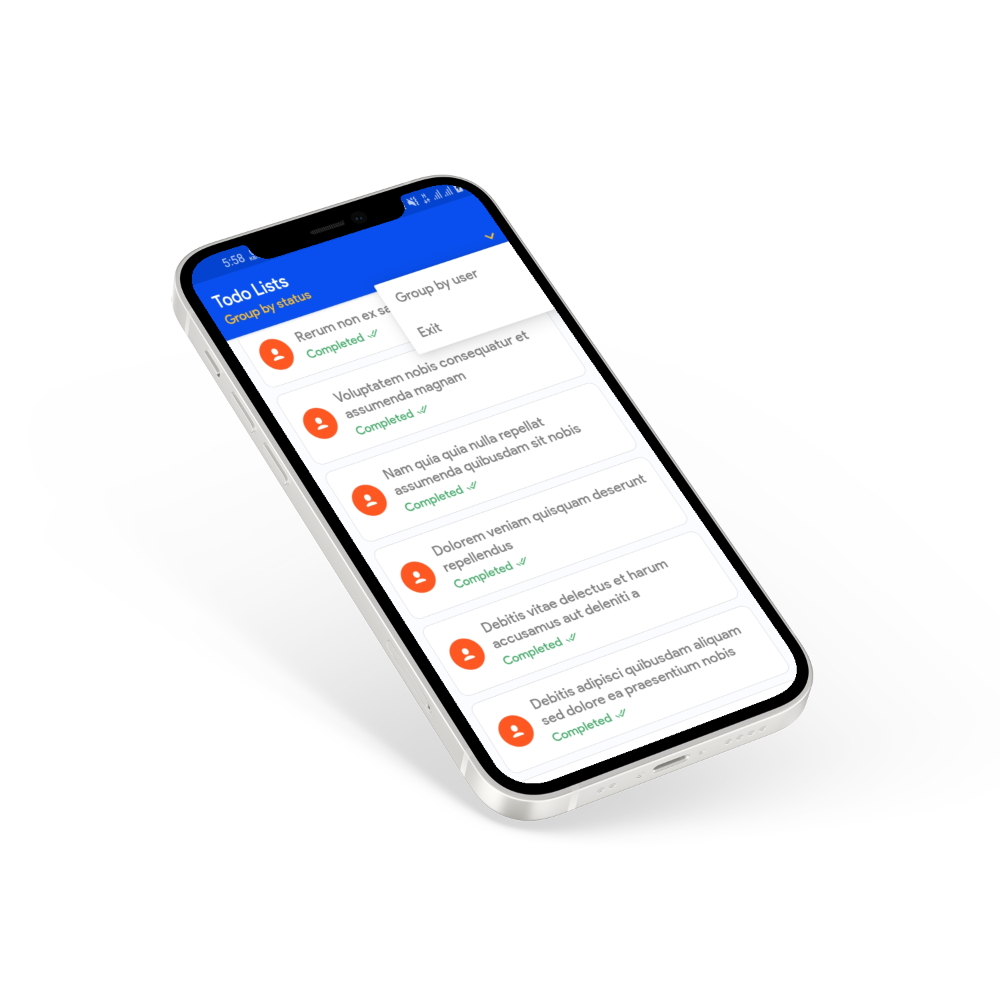
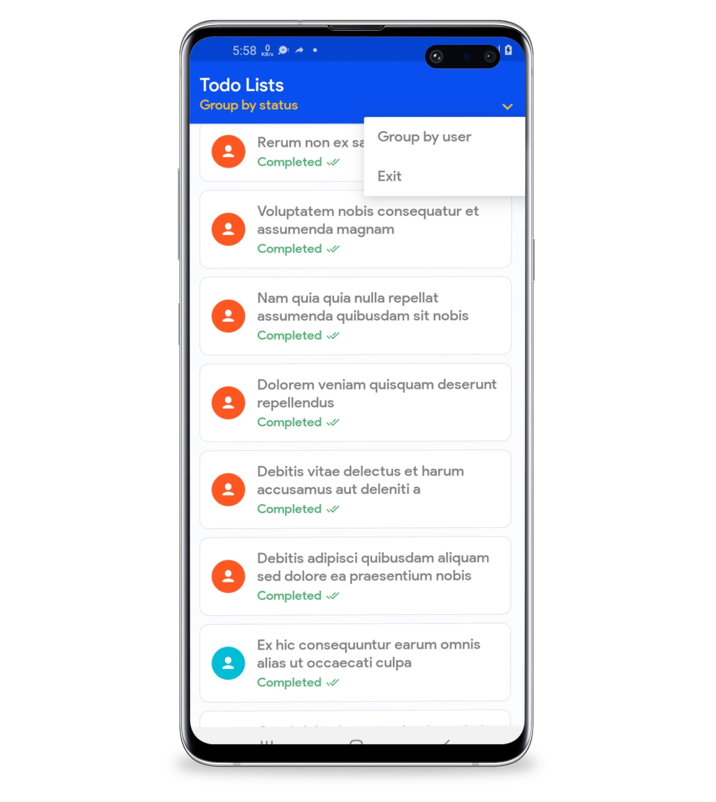

# Simple ToDo App

**Requirements**
- Android Studio 4.0
- JDK 8
- Android SDK 30
- Supports API Level +21
- Material Components 1.3.0

**Highlights**
- Use JSON Data, https://jsonplaceholder.typicode.com/todos
- English language
- Use Dagger dependency injection
- Use Retrofit2 + RxJava
- With MVVM architecture

**Screenshot**

**Libraries & Dependencies**
- [Support libraries]: appcompat / recyclerview / swiperefreshlayout
- [Dagger]: Dagger for dependency injection
- Square [Retrofit] / [Okhttp] / [Logging-Interceptor]
- [RxJava] Reactive Extensions for Android (RxAndroid)

**Credit**

### This app commit for skills testing. starting on 28/06/2021 at 20.00 WIB - 29/06/2021 18.05 WIB
